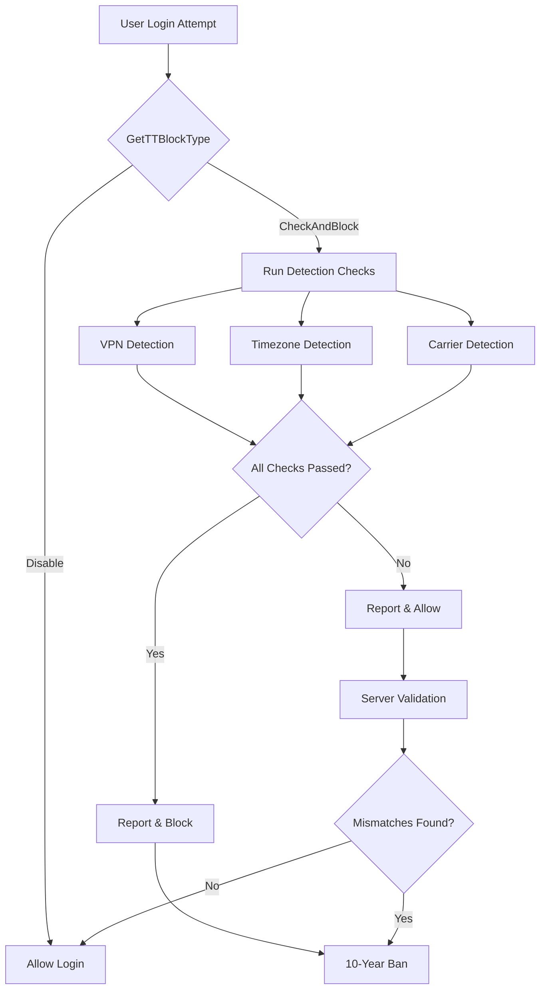

# PUBG Mobile Regional Ban Detection System - Research Analysis

> **⚠️ DISCLAIMER**: This research is for **educational and security research purposes only**. This documentation analyzes existing anti-cheat and regional restriction mechanisms. **Do not use this information to violate terms of service or circumvent regional restrictions.**

## 📋 Table of Contents

- [Overview](#overview)
- [Research Summary](#research-summary)
- [Key Findings](#key-findings)
- [Detection Mechanisms](#detection-mechanisms)
- [Architecture](#architecture)
- [Documentation](#documentation)
- [Ethical Considerations](#ethical-considerations)
- [Contributing](#contributing)
- [License](#license)

---

## 🔍 Overview

This repository contains a comprehensive technical analysis of PUBG Mobile's regional restriction and ban detection system. The research documents the multi-layered security architecture used to enforce geographical restrictions and prevent bypass attempts.

### What This Research Covers

- **Client-side detection mechanisms** (VPN, timezone, carrier detection)
- **Server-side validation systems** (IP geolocation, device fingerprinting)
- **Ban enforcement logic** (trigger conditions, reporting mechanisms)
- **Multi-layer security architecture** (5 distinct security layers)
- **Why bypass attempts fail** (technical deep dive)

### What This Research Does NOT Cover

- Working bypass methods (none exist that aren't immediately detected)
- Exploits or vulnerabilities (none were found)
- Account compromise techniques
- Terms of service violations

---

## 📊 Research Summary

### Current Status: **All Known Bypasses Patched** ❌

PUBG Mobile implements a sophisticated **5-layer security architecture** that makes bypassing regional restrictions functionally impossible:

1. **Layer 1**: Client-side detection (can be spoofed)
2. **Layer 2**: Server-side validation (cannot be bypassed)
3. **Layer 3**: Hardware fingerprinting (permanent identification)
4. **Layer 4**: Account tracking (historical analysis)
5. **Layer 5**: Real-time monitoring (continuous behavioral analysis)

### Why Bypasses Fail

```
Client Override → Server Validates → Mismatch Detected → Automatic Ban
```

The system validates client-reported data against:
- IP geolocation data
- Network carrier information
- Device hardware fingerprints
- Account behavioral history
- Real-time traffic patterns

**Result**: Any mismatch between reported and actual data triggers automatic account suspension.

---

## 🔑 Key Findings

### Detection Methods Identified

| Method | Type | Bypassable | Notes |
|--------|------|------------|-------|
| VPN Detection | Client + Server | ❌ No | Dual-layer verification |
| Timezone Check | Client + Server | ❌ No | Validated via IP geolocation |
| Carrier Detection (MCC) | Client + Server | ❌ No | Cross-referenced with IP |
| Device Platform | Client + Server | ❌ No | Verified via app signature |
| Hardware Fingerprint | Server | ❌ No | Permanent device ID |
| IP Geolocation | Server | ❌ No | Independent verification |
| Account History | Server | ❌ No | Behavioral analysis |
| Network Analysis | Server | ❌ No | Real-time monitoring |

### Ban Trigger Conditions

The system triggers a **10-year ban** when:

1. All client-side checks pass (indicating Chinese region)
2. Multiple data mismatches detected (indicating spoofing)
3. Hardware fingerprint matches banned device
4. Suspicious behavioral patterns identified
5. Repeated bypass attempts detected

---

## 🏗️ Detection Mechanisms

### 1. VPN Detection System

**Client-side**:
```lua
Client.IsSystemVPNOpened()
logic_cloud_game:IsClientVPNConnected()
```

**Server-side**:
- IP address analysis against VPN database
- Traffic pattern analysis
- Connection stability metrics

**Effectiveness**: ✅ **Highly Effective** - Detects VPN even if client reports otherwise

---

### 2. Timezone Detection System

**Client-side**:
```lua
Client.GetTimezoneName()
logic_cloud_game:GetClientTimeZone()
```

**Forbidden Timezones**:
- `asia/shanghai`
- `asia/chongqing`
- `asia/harbin`
- `asia/urumqi`
- `prc`

**Server-side**:
- IP-based timezone calculation
- UTC offset validation
- Cross-reference with carrier data

**Effectiveness**: ✅ **Highly Effective** - Server independently verifies timezone

---

### 3. Mobile Carrier Detection (MCC)

**Client-side**:
```lua
Client.GetCarrierInfo()  // Android
Client.GetOperator()     // iOS
```

**Detection Logic**:
- Checks Mobile Country Code (MCC)
- Bans if MCC = "cn" (China)
- Cross-references with SIM card data

**Server-side**:
- IP-to-carrier mapping
- Network provider verification
- Historical carrier data

**Effectiveness**: ✅ **Highly Effective** - Cannot spoof carrier without real SIM

---

### 4. Hardware Fingerprinting

**Components**:
- Device model (`Client.GetPhoneType()`)
- OS version (`Client.GetOSVersion()`)
- CPU architecture (`Client.GetAndroidSOVersion()`)
- Memory size (`Client.GetMemorySize()`)
- Build properties (implicit)

**Server-side Processing**:
- Creates unique device fingerprint
- Maintains fingerprint database
- Permanent ban on fingerprint match

**Effectiveness**: ✅ **Permanent** - Cannot be changed without hardware modification

---

### 5. Server-Side Validation

**Data Reported**:
```lua
Client.GEMReportSubEvent(GameFrontendHUD, "GRomeLinkEvent", "NewPlayerEvent", {
    entry,          -- Detection step (1-5)
    openid,         -- Account ID
    vpn_status,     -- VPN detection result
    timezone,       -- Detected timezone
    carrier_info,   -- Mobile carrier data
    client_type,    -- Native/Cloud gaming
    time_offset,    -- UTC offset
    language        -- HTTP Accept-Language
})
```

**Server Analysis**:
1. IP geolocation lookup
2. Carrier verification
3. VPN detection
4. Device fingerprint matching
5. Account history analysis
6. Behavioral pattern analysis

**Decision Logic**:
```
If (Multiple Mismatches) → Ban
If (entry == 4 AND from_china) → Ban
If (Suspicious Patterns) → Ban
```

---

## 🏛️ Architecture

### Security Layer Diagram

```
┌─────────────────────────────────────────────────────────────┐
│ Layer 1: Client-Side Detection (Easily Bypassed)            │
├─────────────────────────────────────────────────────────────┤
│ • VPN Check                                                 │
│ • Timezone Check                                            │
│ • Carrier Check                                             │
│ • Platform Check                                            │
│ • Architecture Check                                        │
└─────────────────────────────────────────────────────────────┘
                              ↓
┌─────────────────────────────────────────────────────────────┐
│ Layer 2: Server-Side Validation (Cannot Bypass)             │
├─────────────────────────────────────────────────────────────┤
│ • IP Geolocation Analysis                                   │
│ • Carrier Verification                                      │
│ • VPN Detection                                             │
│ • Timezone Validation                                       │
│ • Cross-Reference Checks                                    │
└─────────────────────────────────────────────────────────────┘
                              ↓
┌─────────────────────────────────────────────────────────────┐
│ Layer 3: Hardware Fingerprinting (Permanent)                │
├─────────────────────────────────────────────────────────────┤
│ • Device Model ID                                           │
│ • OS Version                                                │
│ • CPU Architecture                                          │
│ • Memory Configuration                                      │
│ • Build Properties Hash                                     │
└─────────────────────────────────────────────────────────────┘
                              ↓
┌─────────────────────────────────────────────────────────────┐
│ Layer 4: Account Tracking (Historical)                      │
├─────────────────────────────────────────────────────────────┤
│ • Login History                                             │
│ • Device Association History                                │
│ • Behavioral Patterns                                       │
│ • Purchase History                                          │
└─────────────────────────────────────────────────────────────┘
                              ↓
┌─────────────────────────────────────────────────────────────┐
│ Layer 5: Real-Time Monitoring (Continuous)                  │
├─────────────────────────────────────────────────────────────┤
│ • Network Traffic Analysis                                  │
│ • Behavioral Anomaly Detection                              │
│ • Cheat Detection Systems                                   │
│ • Live Threat Intelligence                                  │
└─────────────────────────────────────────────────────────────┘
```

### Detection Flow



---

## 📚 Documentation

### Core Files

- **[README.md](README.md)** - This file
- **[DETECTION_MECHANISMS.md](docs/DETECTION_MECHANISMS.md)** - Detailed technical analysis of all 15 detection methods
- **[CODE_FLOW_ANALYSIS.md](docs/CODE_FLOW_ANALYSIS.md)** - Complete execution flow from login to ban
- **[BAN_BYPASS_ANALYSIS.md](docs/BAN_BYPASS_ANALYSIS.md)** - Why bypass attempts fail (with examples)
- **[SUMMARY.md](docs/SUMMARY.md)** - Quick reference guide

### Research Methodology

1. **Static Analysis**: Lua source code analysis from game client
2. **Dynamic Analysis**: Runtime behavior observation
3. **Network Analysis**: Server communication patterns
4. **Comparative Analysis**: Before/after patch comparison

### Key Source Files Analyzed

```
/client/logic/login/logic_tt_ban.lua          # Main ban detection logic
/client/umg/bp_global.lua                     # GlobalData and iOS checks
/client/logic/login/login_module.lua          # Login flow
/client/logic/login/device_module.lua         # Device detection
/client/logic/HDmpveRemote/HDmpveRemote.lua   # Remote configuration
```

---

## ⚖️ Ethical Considerations

### Research Ethics

This research was conducted:
- ✅ For educational purposes
- ✅ To understand security mechanisms
- ✅ To document anti-cheat systems
- ✅ To inform the security research community

This research does NOT:
- ❌ Provide working bypass methods
- ❌ Encourage terms of service violations
- ❌ Enable cheating or hacking
- ❌ Compromise user privacy

### Legal Notice

**This research is provided for informational purposes only.** Using this information to:
- Violate PUBG Mobile's Terms of Service
- Bypass regional restrictions
- Access the game from banned regions
- Circumvent anti-cheat systems

...is **illegal** and may result in:
- Permanent account ban (10+ years)
- Legal action from game publisher
- Criminal charges in some jurisdictions

### Responsible Disclosure

No vulnerabilities were found during this research. The security mechanisms documented are **working as intended** and effectively prevent unauthorized access.

---

## 🤝 Contributing

Contributions are welcome! However, please note:

### What We Accept
- ✅ Documentation improvements
- ✅ Technical corrections
- ✅ Additional analysis
- ✅ Security research insights
- ✅ Translation contributions

### What We Reject
- ❌ Working bypass methods
- ❌ Exploits or vulnerabilities
- ❌ Terms of service violations
- ❌ Unethical content

### How to Contribute

1. Fork this repository
2. Create a feature branch (`git checkout -b feature/improvement`)
3. Commit your changes (`git commit -am 'Add analysis'`)
4. Push to the branch (`git push origin feature/improvement`)
5. Create a Pull Request

---

## 📄 License

This research is released under **MIT License** - see [LICENSE](LICENSE) file for details.

### Attribution

If you use this research in your work, please cite:

```
PUBG Mobile Regional Ban Detection System - Research Analysis
https://github.com/SnapyHook/pubg-ban-detection-research
```

---

## 🔗 Related Resources

- [PUBG Mobile Official](https://www.pubgmobile.com/)
- [Tencent Anti-Cheat Expert](https://intl.cloud.tencent.com/product/ace)
- [Mobile Game Security Research](https://github.com/topics/mobile-security)

---

## 📧 Contact

For questions, suggestions, or security concerns:
- **Issues**: [GitHub Issues](../../issues)
- **Discussions**: [GitHub Discussions](../../discussions)

---

## ⭐ Star This Repository

If you found this research useful, please consider starring this repository!

---

**Last Updated**: December 2025  
**Research Status**: Complete  
